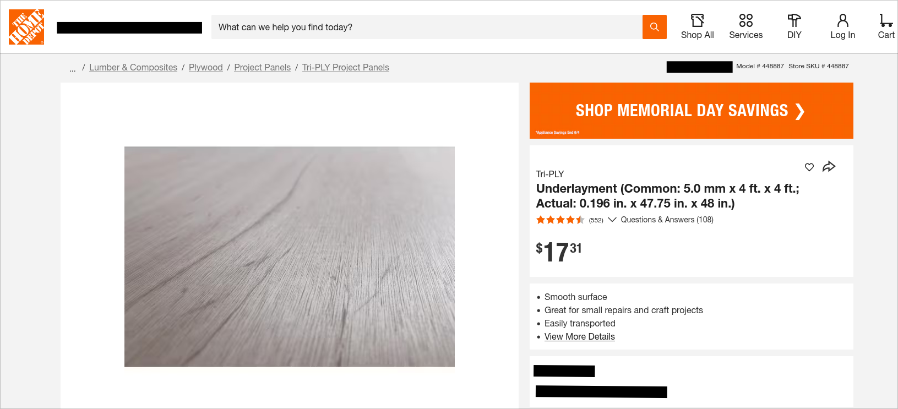
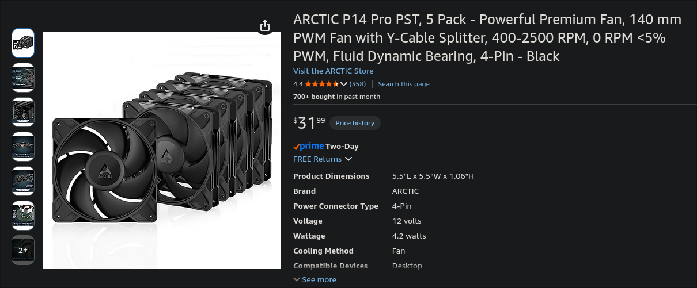
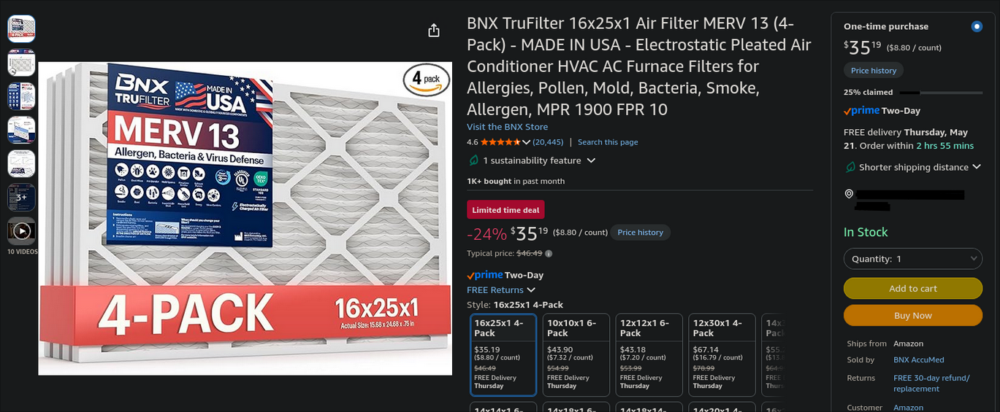

# Corsi-Rosenthal Box

This folder contains the parts list and reference images for a 140mm fan Corsi-Rosenthal Box build.

The product links are still included, but local pictures are saved in `Pictures/` so the parts are still identifiable if a link changes or breaks.

## Printed parts

- [Thingiverse model](https://www.thingiverse.com/thing:7014064)

## Parts

### Plywood / underlayment panel

Used for the thin side panels.

The Thingiverse model calls for:

- `1/4 in nominal plywood`
- `5.5mm actual thickness`
- `4 ft x 4 ft panel`

Cheaper usable option:

- [Home Depot - Tri-PLY 5.0mm x 4 ft x 4 ft Underlayment](https://www.homedepot.com/p/Tri-PLY-Underlayment-Common-5-0-mm-x-4-ft-x-4-ft-Actual-0-196-in-x-47-75-in-x-48-in-448887/202327787)

This panel is listed as:

- `5.0mm common thickness`
- `0.196 in actual thickness`
- `47.75 in x 48 in actual size`

This is slightly thinner than the original model spec, but should fit a `6mm` printed slot without issue. If it fits a little loose, use thin foam tape, hot glue, or a small printed shim.

Avoid plywood much thicker than `5.5mm`, since true `1/4 in` plywood can be close to `6mm` and may be tight in the printed slot.

Cut list:

- `16" x 25"` x2
- `16" x 16"` x2

A single `4 ft x 4 ft` panel is enough for the listed cut sizes.

Simple cut layout:

- Put both `16" x 25"` panels side by side.
- Put both `16" x 16"` panels side by side below them.
- Total used area is about `32" x 41"`.

Before cutting, verify the model instructions and measure the printed slot with calipers.

### Adjustable power adapter / fan power control

Used to power and control the fans.

- [Amazon - adjustable power adapter](https://www.amazon.com/dp/B0FBKBD3C/?psc=1)

### 140mm fans

This build uses 140mm PC fans. A 5-pack gives one extra fan if the model only uses four.

- [Amazon - ARCTIC P14 Pro PST 5-pack](https://www.amazon.com/dp/B0DPX94PSL/?psc=1)

### 16 x 25 x 1 MERV 13 filters

Used as the main filter panels.

- [Amazon - BNX 16x25x1 MERV 13 filter 4-pack](https://www.amazon.com/dp/B09XFKZB2C/?psc=1)

## Notes

This is supplemental room filtration. It is not a replacement for the printer exhaust, HEPA filter, activated charcoal, or window duct setup.

For ASA / ABS printing, still vent and filter the printer enclosure properly.