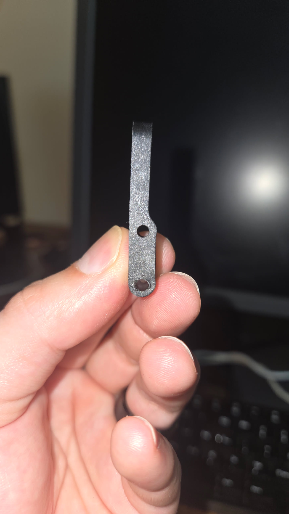
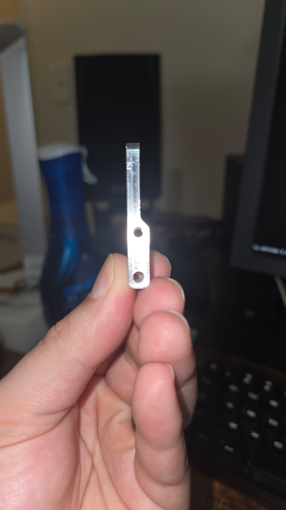
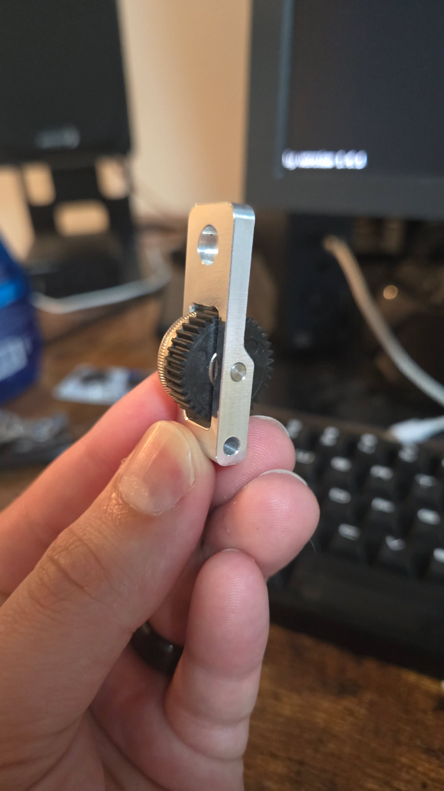
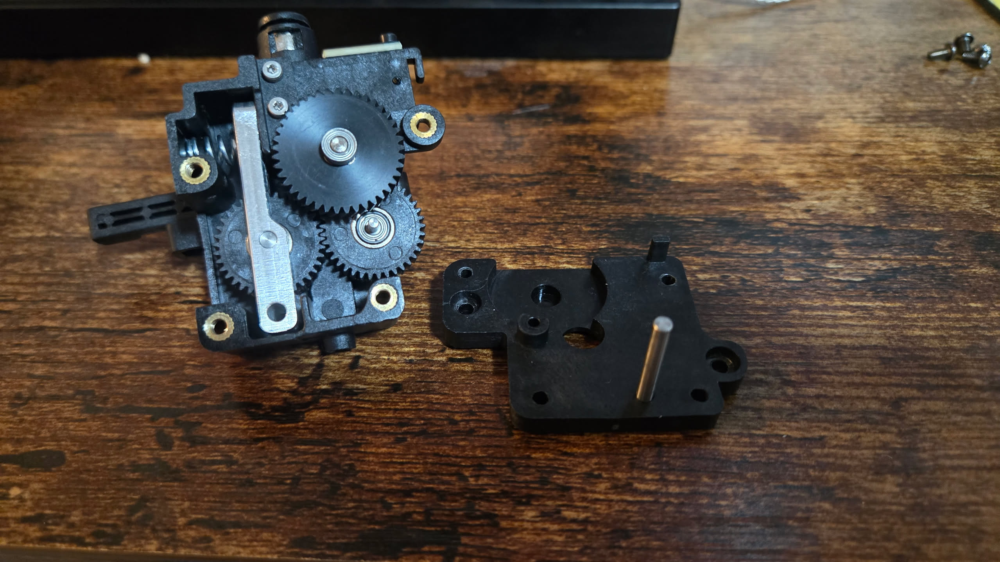

# CNC-Machined Aluminum Extruder Tension Bar

After roughly six months of heavy use, the stock plastic extruder tension bar in my QiDi Plus4 developed significant warping and flex.

The CNC-machined aluminum replacement is substantially more rigid and eliminates the visible deformation present in the original plastic part. I highly recommend this upgrade for long-term reliability and more consistent extruder tension.

## Purchase Link

[QIDI 3D Printer Aluminum Extruder Tension Bar Upgrade](https://www.etsy.com/listing/4514278258/qidi-3d-printer-aluminum-extruder)

I purchased this part myself and posted a verified Etsy review on the product listing.

## Stock Plastic Tension Bar

The original plastic tension bar developed visible warping after extended heavy use.

## Aluminum Tension Bar

The CNC-machined aluminum replacement remains rigid and shows no visible bending or warping. (sorry blurry image)

## Gear Installation

## Installed in the Extruder

