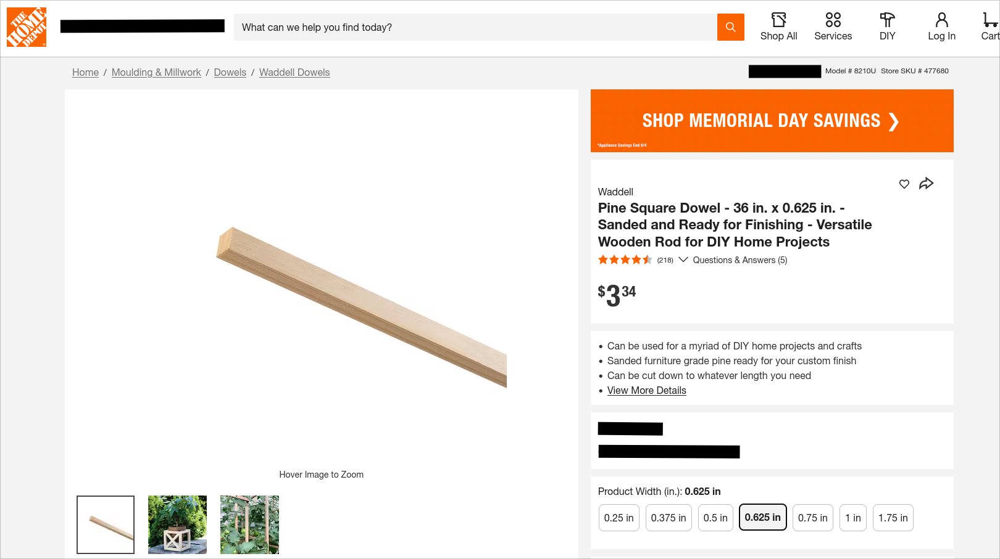
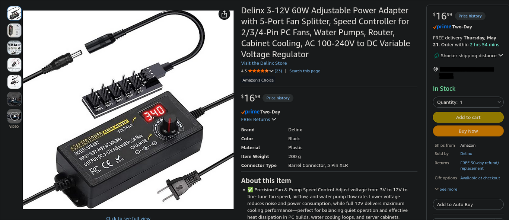

# Corsi-Rosenthal Box

This folder contains the parts list, cut notes, and reference images for a 140mm fan Corsi-Rosenthal Box build.

This is supplemental room air filtration for the printer area. It is not a replacement for printer exhaust, HEPA filtration, activated charcoal, or proper ventilation.

## Printed parts

* [Thingiverse model](https://www.thingiverse.com/thing:7014064)

## Parts

### Plywood / underlayment panel

Used for the thin side panels.

The model calls for:

* `1/4 in nominal plywood`
* `5.5 mm actual thickness`
* `4 ft x 4 ft panel`

Cheaper usable option:

* [Home Depot - Tri-PLY 5.0mm x 4 ft x 4 ft Underlayment](https://www.homedepot.com/p/Tri-PLY-Underlayment-Common-5-0-mm-x-4-ft-x-4-ft-Actual-0-196-in-x-47-75-in-x-48-in-448887/202327787)

This panel is listed as:

* `5.0 mm common thickness`
* `0.196 in actual thickness`
* `47.75 in x 48 in actual size`

This is slightly thinner than the original model spec, but should fit a `6 mm` printed slot without issue. If it fits loose, use thin foam tape, hot glue, or a small printed shim.

Avoid plywood much thicker than `5.5 mm`, since true `1/4 in` plywood can be close to `6 mm` and may be tight in the printed slot.

Panel cut list:

* `8.5" x 24 3/8"` x2 long panels
* `8.5" x 15 3/8"` x2 short panels

Decimal cut sizes:

* `8.5" x 24.375"` x2 long panels
* `8.5" x 15.375"` x2 short panels

A single `4 ft x 4 ft` panel is enough for the listed cut sizes.

### Wood dowels

Used for the box frame.

The model uses `5/8 in x 5/8 in` square wooden dowels.

* [Home Depot - Waddell 5/8 in x 36 in square wood dowel](https://www.homedepot.com/p/Waddell-Pine-Square-Dowel-36-in-x-0-625-in-Sanded-and-Ready-for-Finishing-Versatile-Wooden-Rod-for-DIY-Home-Projects-8210U/329566340)

Buy quantity:

* `36"` dowels x4

Dowel cut list:

* `22 3/8"` x4 long dowels
* `13 3/8"` x4 short dowels

Decimal cut sizes:

* `22.375"` x4 long dowels
* `13.375"` x4 short dowels

If using `36"` dowels, each dowel should provide one long piece and one short piece when accounting for a standard saw kerf.

### Adjustable power adapter / fan power control

Used to power and control the fans.

* [Amazon - adjustable power adapter](https://www.amazon.com/dp/B0FBKBD3C/?psc=1)

### 140mm fans

This build uses 140mm PC fans. A 5-pack gives one extra fan if the model only uses four.

* [Amazon - ARCTIC P14 Pro PST 5-pack](https://www.amazon.com/dp/B0DPX94PSL/?psc=1)

### 16 x 25 x 1 MERV 13 filters

Used as the main filter panels.

* [Amazon - BNX 16x25x1 MERV 13 filter 4-pack](https://www.amazon.com/dp/B09XFKZB2C/?psc=1)

## Cutting notes

Use a cutting optimizer such as OptiCutter to position the panel and dowel cuts.

Remember to include the width of your saw blade, also called the kerf.

Measure twice, cut once.

## Use notes

* Use MERV 13 or better filters.
* Make sure the airflow arrows on the filters point inward toward the fan.
* Add a cardboard or printed shroud on the fan outlet side if the design supports it.
* Do not point the fan directly at the printer enclosure if it causes drafts or chamber temperature instability.
* Run it during and after ASA / ABS prints as extra room air cleanup.
* For fumes, odor, and VOC reduction, keep using activated charcoal and/or exhaust ventilation.

## Notes

This is supplemental room filtration.

It is not a replacement for:

* printer exhaust
* HEPA filtration
* activated charcoal
* window ducting
* proper ventilation

For ASA / ABS printing, still vent and filter the printer enclosure properly.
